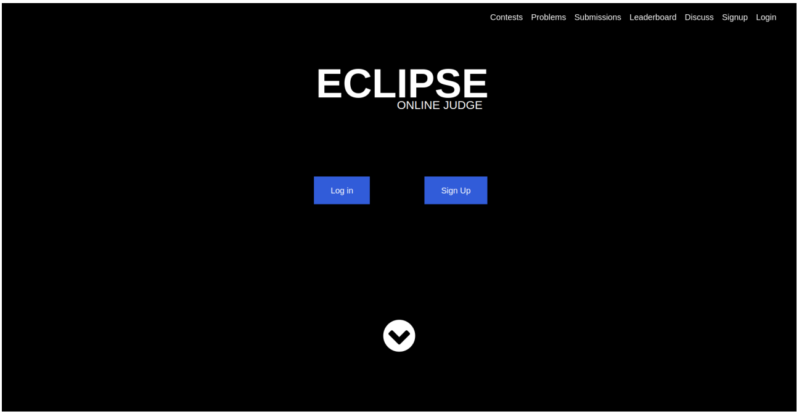
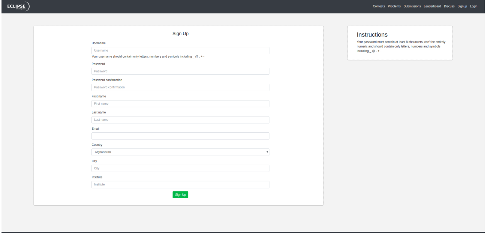
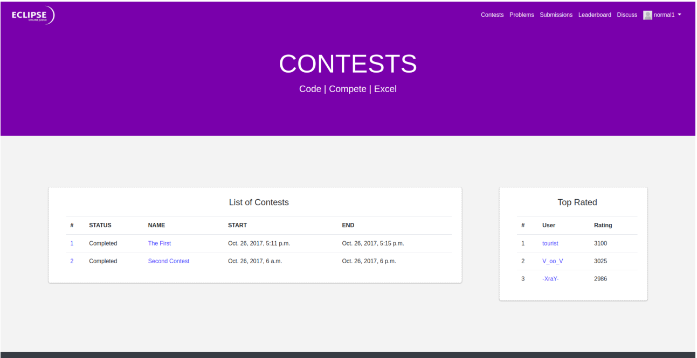
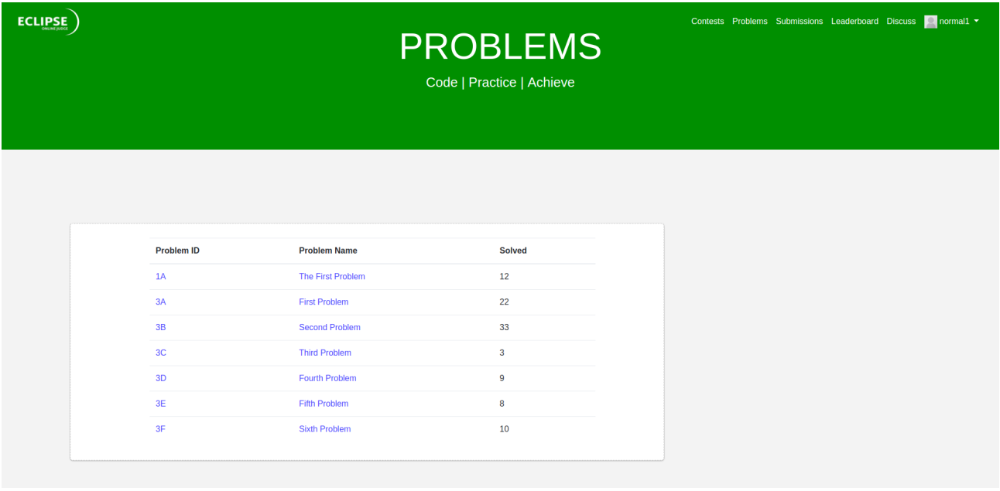
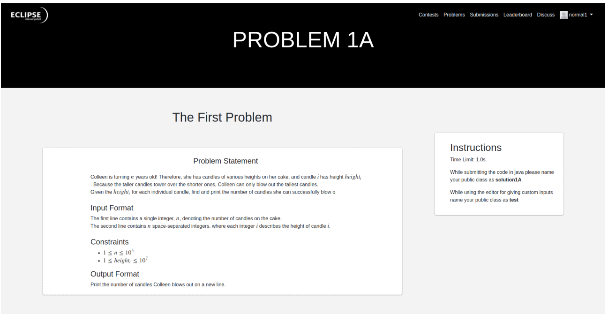
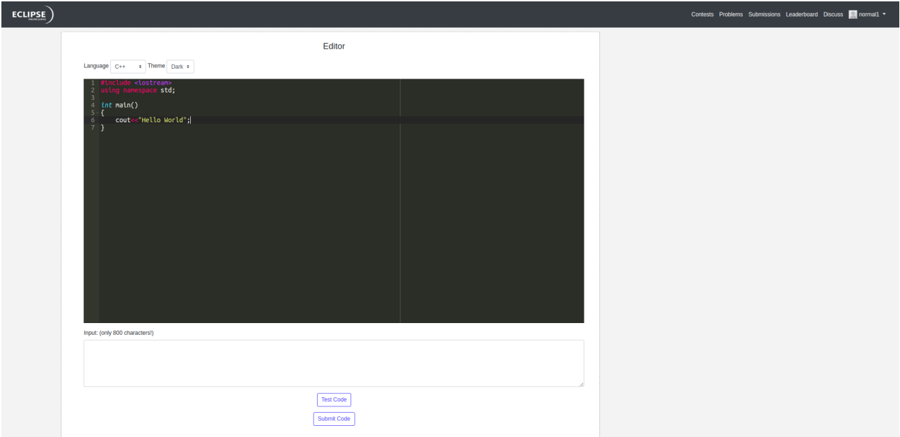
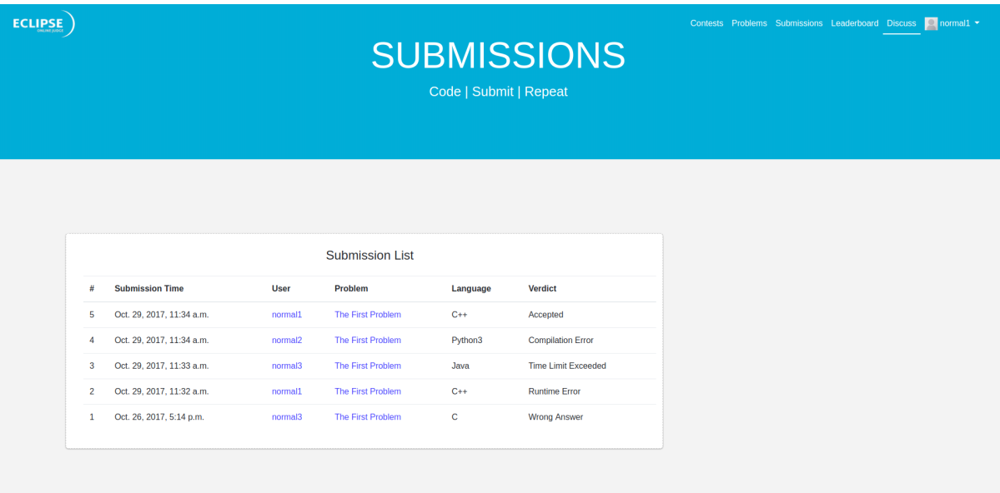

# EclipseOJ
A Django based Open Source Online Judge

## Abstract
Eclipse OJ is an online system to test programs in programming contests and also used to
practice for such contests. The system can compile and execute code, and test them with
pre-constructed data. Submitted code can be run with restrictions, including time limit
and memory limit. The output of the code will be captured by the system, and compared
with the standard output, the system will then return the result.

## Major Softwares/Tools used

• Django 1.11.5

• HTML5, CSS3 (using Sass)

• Javascript (including jQuery, AJAX)

• Docker

• BASH

• MathJax, Bootstrap4 … etc.

## UI
### Homepage
As soon as you login you get this screen where you can login if you are already registered user else sign up

### Sign Up
This is the place where you can register for EclipseOJ

### Contests
#### All contests
This is the place where you can find the links to all the contests. 
We also display the status of the contests like Ongoing, Completed and Future
The right panel shows the top 5 users

#### Specific Contest
This is the place where you can get all the links to the problems of this contest if it is in the past or running currently

### Problems
#### All Problems
Contains a list of all problems

#### Specific Problem
This is the place where you see the problem statement and submission format

### Text Editor
This is the place where you can code online and check with your custom inputs and can
submit directly You will get the editor below every problem where you can code in 5 languages. The editor is customizable with support for a dark and a light theme

### Submissions
This is the place where you can see all the submissions with their verdicts

